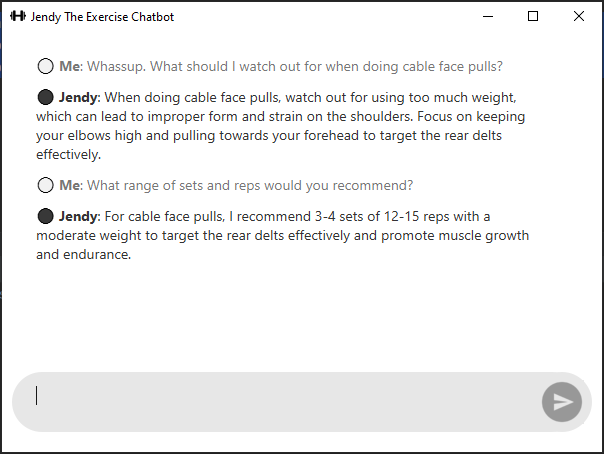

# Project

⚙️ oop, openai, pyqt6, css

⚡   creating a GUI, setting up a chatbot, using LLMs

 

This is Jendy, a chatbot that will give you strength and conditioning advice. I instructed it to pretend to be "a cross between Andy Galpin, professor of kinesiology and exercise scientist, and Jeff Cavaliere, MS PT CSCS and strength coach." So it's legit 😎

As of August 2024, the bot runs on OpenAI's GPT 3.5 Turbo model; max tokens per response is set to 1000. 

 

